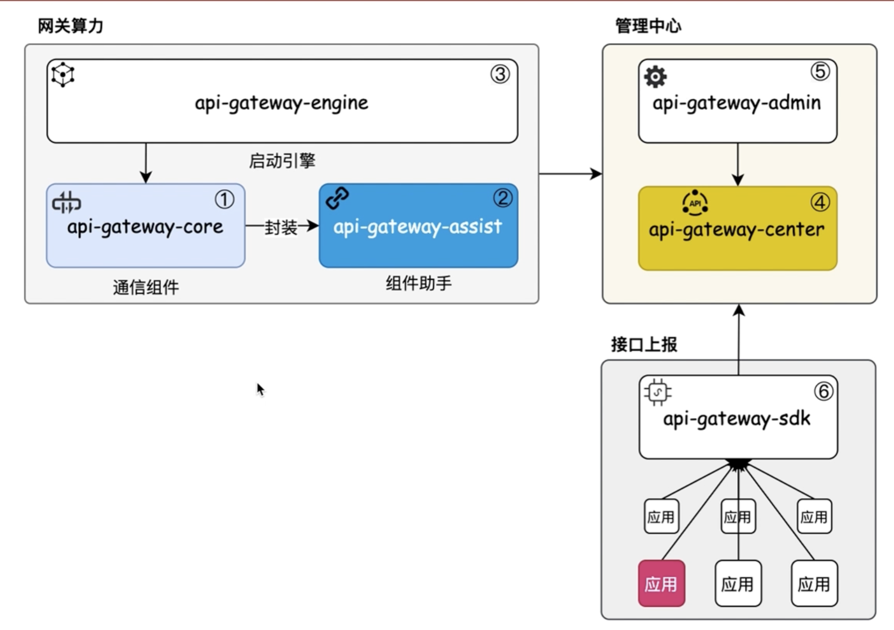

## API Gateway

### 架构

### 启动

1. 启动环境，注意修改路径。docker-compose-environment.yml
2. 启动api-gateway-center
3. 启动3个api-gateway-engine
4. 启动rpc服务，api-gateway-test

### 测试

导入postman文件，修改地址

1. 不需要校验权限测试
   http://192.168.31.251:8090/10001/wg/activity/sayHi 为负载访问方法，
   body传值： {
   "str": "10001"
   }
2. 需要校验权限测试
   http://192.168.31.251:8090/10001/wg/activity/insert header需要uId和token，
   body传值： {
   "name":"maloong",
   "uid":"10001"
   }

